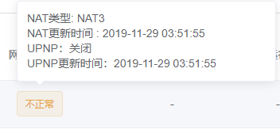

# 常见问题 - 轻节点 - 计算任务

> ### 收益在北京时间的 15点 后更新
> ### 在北京时间 8点 到 15点 期间，正在进行收益计算，因此不显示收益
<br>

***
## Q01 为什么设备解绑后依旧在跑数据？如何解绑设备？
> ### 设备需要 断电离线 并且 我的硬件 列表中显示设备离线才可正常解绑设备，设备依然在线时点击解绑是无法解绑的
> ### 设备解绑后，设备中证书会失效，原先选择的任务也会跟随消失
> ### 解绑后设备端需要做以下操作
> #### ● 路由器：恢复出厂设置
> #### ● N1：在 刷机U盘 的 根目录 下添加 nosave.txt 文件后重刷
> #### ● 我家云 / 粒子云 / 贝壳云：重新刷机
> #### ● x86：格式化系统盘 并 重装系统

## Q02 如何 备份 / 还原 证书？
> ### 仅 开放版 镜像 支持 备份证书 功能，封闭版 暂不支持
> ### 使用 WinSCP 登录设备后，备份以下目录的四个文件，还原同理
```bash
// 目录：/opt/bcloud
ca.crt
client.crt
client.key
node.db
```

## Q03 任务中的字母是什么含义，能否混搭，为什么有些任务选不了？
> ### ● 不同的字母代表不同的任务方，是我们内部对不同业务类型做的区分
> ### ● 不同的称呼不会对资源方产生任何影响，根据自己的环境和任务要求，选择匹配的任务运行即可
> ### ● 不同任务间可以混搭，只要保证硬件配置足够运行所选任务即可
> ### ● 部分任务属于定时限量招募或处于调整状态，因此无法选择
> ### ● 硬件配置不可能会导致导致无法选部分任务

## Q04 为什么跑不起来或效果很差，哪个任务效果比较好？
> ### ● 刚绑定的设备硬盘中无可用数据，切换任务后可能会格式化硬盘导致硬盘中无可用数据
> ### ● 硬盘缓存数据被清除后，需要几天的时间来同步数据
> ### ● 目前 移动网络 下 流量单价 相比 电信 和 联通 会低一些，因此同样流量下 移动网络 会比 电信 和 联通 的更低
> ### ● 无法采集到使用带宽数据会导致没有收益
> ### ● 任务是否跑流量取决于业务方。没有跑流量说明该条线路不满足业务方的调度要求，业务方没有调度，可以检查网络环境是否符合要求，以及查看所在地区能否运行
> ### ● 业务方自己有一个调度的级别，分别是高、中、低、差，通常定期检测，评判标准就是看NAT、带宽 、稳定性、出口、IP变化等，不调度说明该条线路的调度级别被业务方评为低或者差了。等下次检测符合他们的稳定性要求了，就会开始重新调度。
> ### ● 博纳云的后台跟业务方自己的后台是两个不同系统。博纳云后台显示正常，但是博纳云通常不检测出口、IP变化频率等方面，业务方会根据自己需求建立调度的标准。
> ### ● 效果取决于很多方面因素，包括但不限于硬件配置，路由器配置，硬盘性能，业务方需求等

## Q05 网络穿透显示不正常？
> ### 网络穿透信息 每三小时 检测一次，如果有变化会自动上报更新
> ### NAT1 和 UPNP 二选一即可，即：
> #### ● NAT类型为 NAT1 时，可以关闭 UPNP ，且无需关注 UPNP 状态 
> #### ● UPNP 显示 开启 时，无需关注 NAT类型
> ### DMZ 和 UPNP 在 光猫拨号 模式下可能会存在开启后没有改变的问题
> ### 在 没有 公网IP 且 光猫桥接 路由器拨号 并 开启 NAT1 或 DMZ 后，最终能否 NAT1 取决于运营商是否支持 NAT1
> ### 建议使用 爱快、OpenWrt 等比较主流的路由器固件以获得更好的网络环境，不建议使用 ROS
> ### 刚刚激活的设备需要等待 半小时 到 三小时 不等，等待设备上报信息
> ### 部分固件 UPNP 有问题，例如：高恪会显示UPNP关闭或者内网IP 
> ### 可以将鼠标移动到不正常上，浮窗中会显示 NAT类型，UPNP状态 以及 状态更新时间，如图所示：





## Q06 CPU、内存、硬盘等硬件信息不显示？
> ### 硬件信息 每三小时 更新一次，每次重启后都会自动检测并更新
> ### 刚刚激活的设备需要等待设备上报信息
> ### 如果三小时后仍然不显示，可从以下方面排除： 
> #### ● 开启 IPv6 并将 DNS地址 改为 223.5.5.5 和 223.6.6.6
> #### ● 如果是脚本安装的，检查 k8s 是否正常运行 
> #### ● 如果是通过镜像安装的，重新刷写固件或检查固件包的 MD5 是否与下载页提供的 MD5一致 
> ### 其余信息正常，但是硬盘不显示或突然变为0，可从以下方面排除：
> #### ● 硬盘有问题：包括但不限于硬盘之前被高强度使用或损坏 硬盘供电不足(常见于使用集中供电) 
> #### ● USB口供电坏了(常见于N1等开发板设备)

## Q07 在路由器看见有跑流量，但是没有收益 / 官网 设备总览 处有提示有设备无带宽数据 或 监控没有显示使用带宽？
> ### 这种情况是可能是采集挂了，可以尝试以下方法： 
> #### ● 重启设备
> #### ● 开启 IPv6 并将 DNS地址 改为 223.5.5.5 和 223.6.6.6
> #### ● 设备硬件配置不够，升级系统配置
> #### ● 前往 [论坛故障反馈](https://bonuscloud.club/viewtopic.php?f=31&t=5389) 处贴上 设备mac地址 和 问题 进行反馈

## Q08 不显示调度状态 / 设备调度失败 / 该设备暂不支持调度？
> ### 调度状态 每两小时 更新一次
> ### 如果是刚刚激活，等待系统自动调度即可
> ### 系统关机或断网后，重新启动后可能会显示调度状态变为调度失败，此时一般等待后台重新调度并且更新调度状态即可
> ### 如果是设备调度失败/该设备暂不支持调度，可以将鼠标移动到旁边的标记查看原因：
> #### ● 请排查DNS解析是否正常：将 DNS地址 改为 223.5.5.5 和 223.6.6.6
> #### ● 自动修复中，等待重新调度：等待即可
> #### ● 请将硬盘格式化为EXT4格式：将硬盘插入电脑并用 DiskGenius 格式化为 EXT4，分区表 改为 MBR 后重新接入设备
> #### ● 硬盘空间不足：手动格式化硬盘后重试
> #### ● 问题待定，请加入交流群联系官方人员：前往 [论坛故障反馈](https://bonuscloud.club/viewtopic.php?f=31&t=5389) 处贴上 设备mac地址 和 问题 进行反馈

## Q09 为什么 同步数据总量 数字变化很慢 / 总是很小？
> ### ● 同步数据总量 每天 更新一次
> ### ● A任务，D任务，F任务 不同步数据 或 数据同步速度很慢 说明 硬盘写入 存在问题，需要检查硬盘是否正常
> ### ● C任务 和 H任务 不同步数据也能跑
> ### ● 对于已经有一定数量缓存的设备而言，每天变化数字不会很大，甚至可能会有变少，这是正常情况

## Q10 我想调整配置 / 换系统，怎么办？
> ### CPU核心数、内存大小：直接调整后等待等待半小时到两小时上报新的信息即可 
> ### 网卡：如果更换后mac地址发生变化，需要重新安装部署绑定 
> ### 数据盘调整： 
> #### ● 物理机或数据盘直通到虚拟机中的：直接更换数据盘即可 
> #### ● 虚拟机：需要删除原有的数据盘，然后建一个新的数据盘 
> #### ● 开发板等设备(例如N1)：直接更换即可 按照正确操作更换数据盘后需要等待半小时到两小时上报新的信息
> ### 如果需要更换系统，不需要保留证书的，直接更换即可。需要更换系统的，开放版镜像可以自行备份后更换，封闭版镜像需要解绑后重新绑定

## Q11 我想给N1等设备重新刷机，怎么办？
> ### ● N1：直接将官方镜像写入U盘后，插上U盘再通电，等待系统写入完毕断电拔掉U盘即可，默认状态下证书不会被清除。需要清除证书的，需要在制作好U盘后，打开BOOT分区，在根目录下新建一个nosave.txt即可在刷机时清除证书 
> ### ● 我家云 / 粒子云 / 贝壳云：刷机时由于会抹除掉整个emmc，因此刷机前需要将设备离线后在官网后台解绑，刷机后才能正常绑定。

## Q12 为什么 N1 / R3300L机顶盒 配机械硬盘只能跑20Mbps左右？
> ### ● 由于 USB 2.0 的半双工工作模式，导致机械硬盘的性能表现弱于在 USB 3.0 的全双工模式，建议更换固态硬盘以获得更好表现。
> ### ● 也可以考虑使用我家云等原生支持 USB 3.0 接口的机顶盒搭配固态硬盘。
> ### ● 更多内容可参考：[此处](https://bonuscloud.club/viewtopic.php?f=15&t=6536&p=24033#p24033)

## Q13 什么是内存溢出？
> ### 当出现以下提示内容时，表明 内存不足，需要增加内存。
```bash
memory cgroup out of memory
```